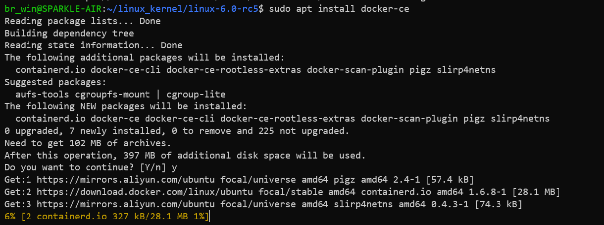
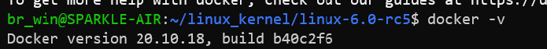
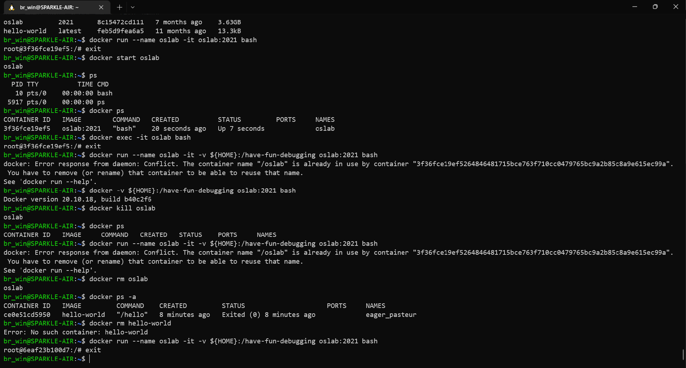
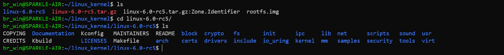
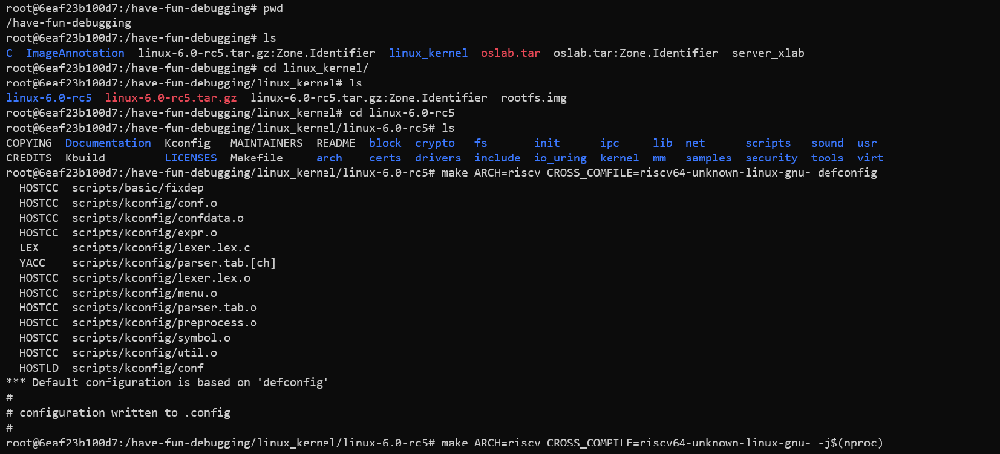
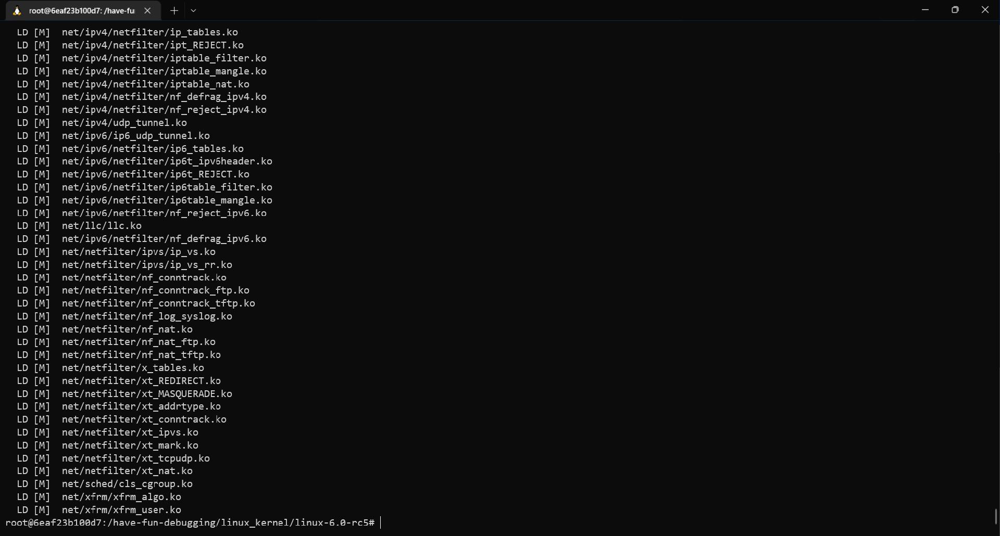
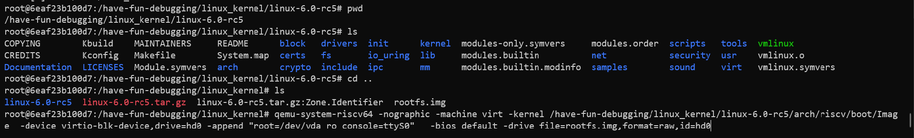
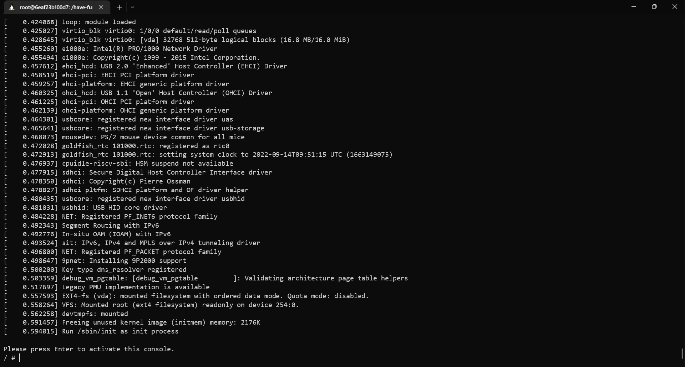

# OS-lab0

## 安装Docker

根据docker的安装教程安装新版本的Docker



安装完成



## 搭建Docker环境

按照实验步骤进行，成功搭建了Docker环境。

期间出现的Error是由于在之前的命令中已经有了oslab容器的存在，因此无法新建，当使用rm命令删除oslab容器之后，即可正常执行最后一条命令。




## 获得Linux源码

在Linux官网下载并解压Linux源码




## 编译Linux内核

按照Manual生成配置并对Linux内核进行编译



编译完成



根据自身情况调整参数运行：

```bash
qemu-system-riscv64 -nographic -machine virt -kernel /have-fun-debugging/linux_kernel/linux-6.0-rc5/arch/riscv/boot/Image  -device virtio-blk-device,drive=hd0 -append "root=/dev/vda ro console=ttyS0"   -bios default -drive file=rootfs.img,format=raw,id=hd0
```



成功启动QEMU运行内核



## 心得体会

这次lab0踩了很多坑，不过基本上都是踩在了一开始自己配环境的时候。前期的配环境除了我的apt源过旧的问题，更新了一下源外，并没有出其他什么大的问题，但是（怀疑）由于qemu在Ubuntu的apt源中版本过低的问题，导致在使用qeme启动时报了

> qemu-system-riscv64: Unable to load the RISC-V firmware "opensbi-riscv64-virt-fw_jump.bin"

的错误。为了防止在之后的Lab中出现一些类似于版本不兼容等难以解决的奇奇怪怪的问题，以及为了和队友的开发环境保持一致，因此还是使用了docker。

在使用gdb进行调试的时候，一直会出现start_kernel的函数无法打上断点的情况。后来是通过更换qumu的版本解决的问题。再后来得知了，只需要再gdb调试的时候加上```set riscv use-compressed-breakpoints on```，就也可以解决这个问题。
