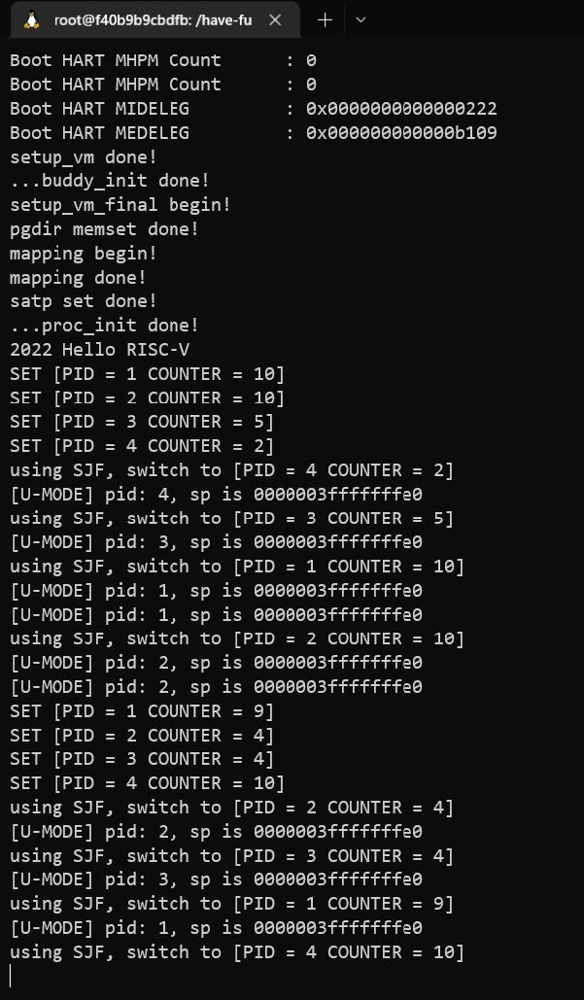

# OS lab5 Report

## 实验过程

### 4.1 准备工程

按照实验手册完成以下操作：

- 修改 `vmlinux.lds.S`
- 修改 `defs.h`
- 同步`ropo`
- 修改**根目录**下的 Makefile, 将 `user` 纳入工程管理。注意此处`user`部分需要放在`arch/riscv`部分前面，因为该部分中的`vmlinux.lds.S`用到了`user`部分的文件（如`uapp.o`）

```makefile
all:
	${MAKE} -C user all
	${MAKE} -C lib all
	${MAKE} -C init all
	${MAKE} -C arch/riscv all
	
	@echo -e '\n'Build Finished OK

```

### 4.2 创建用户态进程

1. 修改 `proc.h` 中的 `NR_TASKS` 为

```c
#define NR_TASKS  (1 + 4) // 用于控制 最大线程数量 （idle 线程 + 31 内核线程）
```

2. 更改 `thread_struct` ，添加 `sepc` `sstatus` `sscratch`。

```c
/* 线程状态段数据结构 */
struct thread_struct {
    uint64 ra;
    uint64 sp;
    uint64 s[12];
    uint64_t sepc, sstatus, sscratch;
};
```

3. 按照实验手册修改 `task_struct` 。

4. 修改`task_init`

有几个修改的重点（坑）：

- 由于我们的`kernel_sp`和`user_sp`是存在`thread_info`里面的，而我们可以在`proc.h`中发现，在`task_struct`里面的`thread_info`是一个指针，这意味着我们并没有给它分配内存，这时候如果我们直接给里面赋值就会报错。因此我们在赋值之前需要先分配一个内存地址给`thread_info`。
- 这个在`task_struct`中出现的没有注释的`pgd`在经过分析之后应该是用于存储每个用户进程各自的`satp`，其全名可能是`page_dir`。该参数将会在我们切换进程的时候用到。

```c
		//set S-Mode and U-Mode stack
        //一个坑,thread_info没有分配内存。
        //解决方案:给一个page(不过有点浪费QAQ)
        task[i]->thread_info = (struct thread_info*)alloc_page();
        task[i]->thread_info->kernel_sp = task[i]->thread.sp;
        // task[i]->thread_info->kernel_sp = (uint64)task[i] + PGSIZE;
        task[i]->thread_info->user_sp = alloc_page();

        //为每个用户态创建自己的页表
        pagetable_t pageTable = alloc_page();
        //复制内核页表，避免在陷入切换U/S-Mode时需要立即更换satp
        for (uint64 i = 0; i < PGSIZE; i++) 
            ((char*)pageTable)[i] = ((char*)swapper_pg_dir)[i];

        //映射uapp,给予XWR权限,UV也为1
        uint64 virtualAddress = USER_START;
        uint64 physicalAddress = (uint64)(uapp_start)-PA2VA_OFFSET;
        create_mapping(pageTable, virtualAddress, physicalAddress, (uint64)(uapp_end)-(uint64)(uapp_start), 31);

        //映射U-Mode Stack,给予WR权限,UV也为1
        virtualAddress = USER_END-PGSIZE;
        physicalAddress = task[i]->thread_info->user_sp-PA2VA_OFFSET;
        create_mapping(pageTable, virtualAddress, physicalAddress, PGSIZE, 23);

        //set sepc
        task[i]->thread.sepc = USER_START;

        //set sstatus
        uint64 pre_sstatus = csr_read(sstatus);
        uint64 now_sstatus = pre_sstatus & 0xfffffffffffffeff; //sstatus[SPP] = 0
        now_sstatus = now_sstatus | (1<<5); //sstatus[SPIE] = 1
        now_sstatus = now_sstatus | (1<<18); //sstatus[SUM] = 1
        task[i]->thread.sstatus = now_sstatus;

        //set sscratch
        task[i]->thread.sscratch = USER_END;

        //设置pgd,即satp
        uint64 pre_satp = csr_read(satp);
        uint64 satp_prefix = (pre_satp >> 44) << 44;
        uint64 now_satp = satp_prefix | (((uint64)pageTable-PA2VA_OFFSET) >> 12);
        task[i]->pgd = now_satp;
```

5. 修改`__switch_to`

```assembly
# save state to prev process
# 略
# save csr
    csrr t0, sepc
    sd t0, 152(a0)
    csrr t0, sstatus
    sd t0, 160(a0)
    csrr t0, sscratch
    sd t0, 168(a0)
    csrr t0, satp
    sd t0, 176(a0)
# restore state from next process
# 略
# write csr
    ld t0, 152(a1)
    csrw sepc, t0
    ld t0, 160(a1)
    csrw sstatus, t0
    ld t0, 168(a1)
    csrw sscratch, t0
    ld t0, 176(a1)
    csrw satp, t0

    # flush tlb
    sfence.vma zero, zero

    # flush icache
    fence.i

    ret
```

### 4.3 修改中断入口/返回逻辑 ( _trap ) 以及中断处理函数 （ trap_handler ）

1. 修改`__dummy`。该函数仅在某个线程第一次被调用时进入，我们不再需要在此处修改`sepc`，因为在之前的`__switch_to`已经设置好了`sepc`。在这里我们仅需要切换Stack，因为我们即将从内核态进入到用户态。

```assembly
__dummy:
    # la t0, dummy
    # csrw sepc, t0;
    # 不需要设置sepc,因为我们不再去dummy()了
    # 而且__swich_to已经设置好了我们要去的sepc(USER_START)

    # 交换sp和sscratch来切换U-stack和S-stack
    csrr t0, sscratch
    csrw sscratch, sp
    mv sp, t0
    sret
```

2. 修改`_traps`

我们需要在`_traps`的首尾加上对`sscratch`的检查，如果`sscratch`不为0，说明触发trap的是用户进程，那我们我们就应该在进入trap前切换成`S-stack`，在退出trap前切换成`U-stack`。

3. 修改`trap_handler`

我们为`trap_handle`函数增加`struct pt_regs *regs`定义

```c
struct  pt_regs
{
    uint64 reg[32];
    uint64 sepc;
    uint64 sstatus;
};
```

### 4.4 添加系统调用

1. 添加系统调用模块

```c
// 系统调用号使用a7,入参a0~a5,返回值a0/a1
void syscall(struct pt_regs *regs, uint64 sepc){
    if(regs->reg[17] == 64){    //sys_write
        sys_write(regs,regs->reg[10],regs->reg[11],regs->reg[12]);
    }
    else if(regs->reg[17] == 172){  //sys_getpid
        sys_getpid(regs);
    }
    else{
        printk("Other syscall occured! a7=%d\n",regs->reg[17]);
    }

}

void sys_write(struct pt_regs *regs, unsigned int fd, const char* buf, size_t count){
    if (fd == 1) {
        uint64 return_value;
        for(size_t i = 0; i < count; i++){
            return_value = printk("%c", buf[i]);
        }
        regs->reg[10] = return_value;
    }
}

void sys_getpid(struct pt_regs *regs){
    regs->reg[10] = current->pid;
}
```

2. 手动`sepc+4`

如果是用户态发出的系统调用，那我们需要手动在trap调用之后给`sepc`加上4来继续运行下一条指令。

```assembly
# entry.S
# 首先使用t0取出sepc和sstatus
    ld t0,264(sp)
    csrw sstatus,t0
    ld t0,256(sp)
# 如果不是系统调用，那就不用给sepc加上4了
    csrr t1, scause
    addi t2, zero, 0x8
    bne t1, t2, _no_need_change_sepc
    addi t0,t0,0x4
_no_need_change_sepc: 
    csrw sepc,t0
```

### 4.5 修改 head.S 以及 start_kernel

1. 在`start_kernel`函数中加上`schedule()`，这样我们就可以在内核启动后直接进入进程切换，切换到用户进程运行`uapp`。但是这步并不会设置下一次时钟中断，所以我们不能在`head.S`中取消第一次时钟中断的设置。
2. 修改`head.S`，关闭S-mode下的中断（即不设置`sstatus[SIE]=1`），防止打断start_kernel中的schedule()

### 4.6 测试纯二进制文件

测试结果如下：



## 思考题

> 我们在实验中使用的用户态线程和内核态线程的对应关系是怎样的？（一对一，一对多，多对一还是多对多）

我们的每个用户态线程都有一个对应的内核态线程来进行调度，因此是一对一的关系。

> 为什么多个进程的栈虚拟地址可以是相同的？用户有没有常规的方法知道自己栈所在的物理地址？

我们的四个用户态都分别有两个栈

- S-Mode-stack：创建于`task_init`中，实际空间在存放`task_struct`数据的页的末尾
- U-Mode-stack：创建于`task_init`中，实际空间位于我们使用`alloc_page`开辟的空间

因此我们可以看出来，这4*2个栈的物理位置都是不同的。然后我们在`task_init`中都将`U-Mode-stack`映射到了`USER_END-PGSIZE`。而且每一个用户态进程都享有自己的页表（即之前提到的`pgd`)，因此虽说是同一个虚拟地址，但是通过各自的页表所找到的对应的物理地址还是不同的。这点也是由虚拟地址提供的强大功能之一。

因为用户栈的物理地址信息是储存在内核态的，所以正常情况下是没法拿到的。（但是或许我们可以写一个专门拿用户态栈物理地址的`syscall`，就跟第172号系统调用拿`pid`一样，如果系统调用算常规方法的话）

